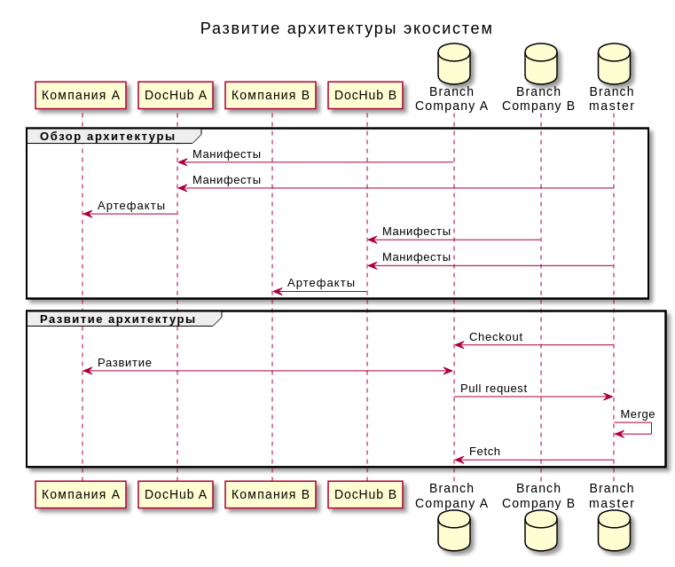
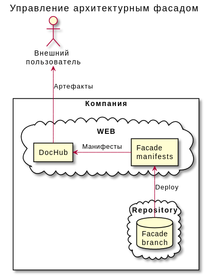
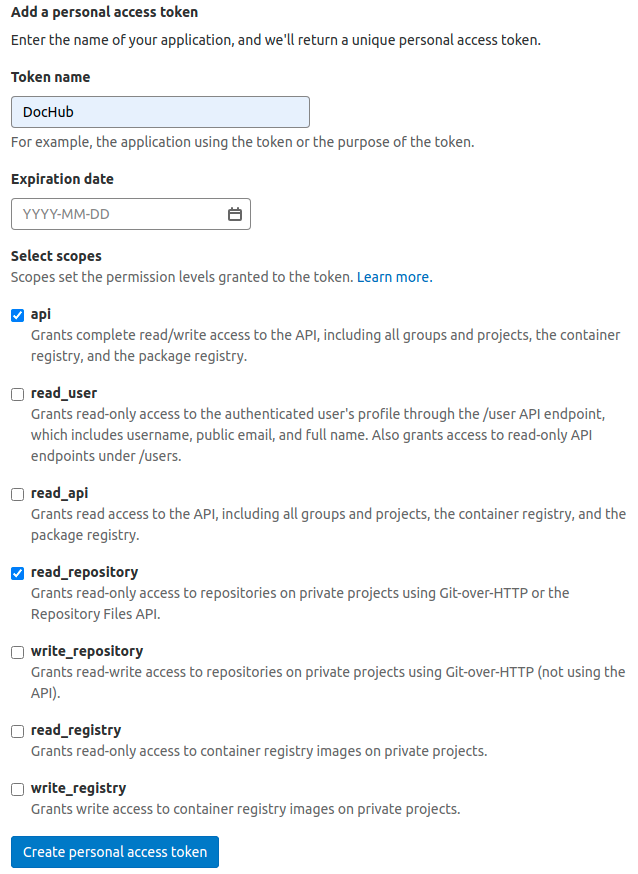

# DocHub


DocHub - инструмент описания архитектуры через код (Architecture as a code). Код архитектуры - ансамбль файлов на языках,
решающих задачу описания. Поддерживаются:

* [PlantUML](https://plantuml.com/) - позволяет создавать диаграммы, используя простой и интуитивно понятный язык;
* [Markdown](https://ru.wikipedia.org/wiki/Markdown) - язык разметки, созданный с целью обозначения форматирования в тексте;
* [Swagger](https://swagger.io/) - язык описания HTTP API контрактов;
* [Манифесты](https://dochub.info/docs/dochub_contexts) - структурированные файлы в формате YAML/JSON для описания архитектурных объектов.

Решаемые проблемы:

* [Управление версиями](#versions);
* [Децентрализованное управление архитектурой в Agile-ориентированных компаниях](#decentralized);
* [Управление архитектурой экосистемы](#ecosystem);
* [Создание архитектурных фасадов (портал документации)](#facade);
* [Контроль консистентности](#problems).

[Живое демо и подробная документация](https://dochub.info/)

## <a name="versions"></a> Управление версиями архитектуры

DocHub позволяет развивать кодовую базу архитектуры аналогично кодовой базе приложений. В качестве системы управления
версиями используется GitLab.


## <a name="decentralized"></a> Децентрализованное управление архитектурой в Agile-ориентированных компаниях

DocHub умеет консолидировать описание архитектуры из различных источников. Например, из разных репозиториев. Это
позволяет командам действовать независимо в сотрудничестве друг с другом.


## <a name="ecosystem"></a> Управление архитектурой экосистем

DocHub создан с учетом современных проблем в управлении архитектурой экосистемы. В ней продукты взаимосвязаны,
но развиваются автономно. DocHub позволяет создать единое информационное пространство для экосистемы. Стимулирует
положительную синергию продуктов.



## <a name="facade"></a> Архитектурные фасады

DocHub хорошо решает задачу публичного портала документации.



[Пример портала](https://dochub.info/).

## <a name="problems"></a> Контроль консистентности архитектуры

DocHub умеет находить проблемы в описании архитектуры.


## Развертывание

### Конфигурирование

Определите необходимые переменные окружения. Используйте файл примера [example.env](example.env) для этого. Переименуйте его для
продакшен окружения в ".env" для локального развертывания в ".env".

Если вы ничего не будете трогать, развертывание произойдет с дефолтными настройками. В этом случае DocHub будет
содержать собственную документацию.

### Локальное развертывание

Выполните команды:
```
docker-compose up --build
```
DocHub станет доступен по адресу [http://localhost:8080/main](http://localhost:8080/main)

### Сборка из исходников для продакшен

Проект является VueJS SPA приложением. В качестве backend пользуется GitLab.

Для развёртывания потребуется стандартная сборка VueJS приложения средствами npm.
```
npm install
npm run build
```

В результате будут сгенерированы статические файлы в папке /dist. Их необходимо
опубликовать используя web-сервер. Например, nginx.

Подробнее о вариантах развертывания можно узнать [тут](https://cli.vuejs.org/ru/guide/deployment.html).

## Интеграция с GitLab
### Для локального развертывания
В файле "example" укажите адрес GitLab в соответствующей переменной:
```
VUE_APP_DOCHUB_GITLAB_URL=https://foo.space
```

В GitLab **под своей учетной записью** выпустите персональный токен Profile->Preferences->Access Tokens



Полученный токен укажите в файле ".env" в переменной:
```
# Персональный токен gitlab. Используется для локальной разработки
VUE_APP_DOCHUB_PERSONAL_TOKEN=9H...FR
```

Перезапустите контейнеры:
```
docker-compose down
docker-compose up --build
```

### Локальное развитие архитектуры

Создайте папку "/public/workspace". Папка входит в .gitignore. Это нормально. Папка предназначена для
локального развертывания архитектурных репозиториев. Клонируйте необходимый архитектурный репозиторий.

```
cd /public/workspace
git clone git@git.foo.space:repo.git
```

Определите в ".env" переменную корневого манифеста:

```
VUE_APP_DOCHUB_ROOT_MANIFEST=workspace/repo/root.yaml
``` 

Перезапустите контейнеры:

```
docker-compose down
docker-compose up --build
```

Теперь вы можете вносить изменения в репозиторий локально и видеть результат изменений в режиме реального времени.

### Для продакшена
В файле ".env" укажите адрес GitLab в соответствующей переменной:
```
VUE_APP_DOCHUB_GITLAB_URL=https://foo.space
```

Настройте OAuth2 service provider в GitLab. Документацию по настройке можно найти на
[официальном сайте](https://docs.gitlab.com/ee/integration/oauth_provider.html).


Полученные токены укажите в файле .env в переменных:
```
# Идентификатор приложения зарегистрированного в GitLab
VUE_APP_DOCHUB_APP_ID=5f3...f0

# Секрет приложения
VUE_APP_DOCHUB_CLIENT_SECRET=1e4...384
```

Соберите приложение:
```
npm run build
```

# Статьи
* [Архитектура как кот VS Архитектура как кол](https://habr.com/ru/company/rabota/blog/578340/);
* [Архитектура как данные](https://habr.com/ru/post/593009/);

# Лицензия
DocHub распространяется под лицензией
[GNU GPL v.2](http://www.gnu.org/licenses/old-licenses/gpl-2.0.html)
Open source license.
