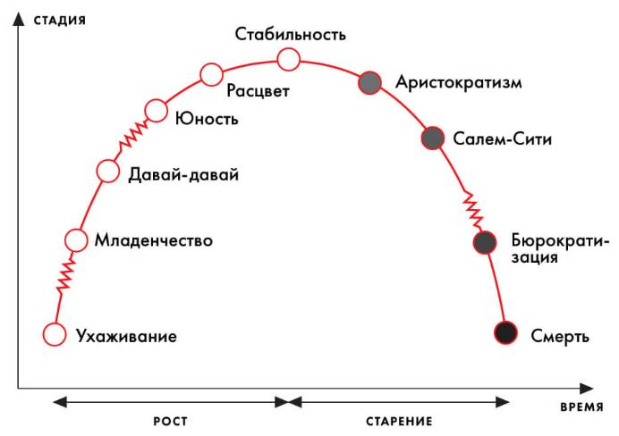

# Сущности(entities)

Архитектурная функция развивается совместно с бизнесом в котором она реализуется.
На различных этапах зрелости ей свойственны различные потребности в детальности и качестве управления архитектурой.
DocHub эту адаптивность обеспечивает через инструментализацию развития метамодели.

## Этапы развития бизнеса



На ранних стадиях владельцем архитектурного замысла является создатель бизнеса. С этапа "Давай-давай" начинается 
бурный рост организации. В управление архитектурным замыслом вовлекаются все больше число участников. 

Именно на здесь, чаще всего, организация начинает осознавать потребность в управлении своей архитектурой.

Важно отметить, что с ростом зрелости меняется и суть потребности в управлении архитектурой. На ранних
этапах развития бизнес стремится занять свою нишу на рынке. Его потребность в архитектурной функции можно выразить так:

```
Генерация архитектурных решений для получения конкурентных преимуществ на целевом рынке.
```

Для этапа свойственны:
1. Потребность в быстрых проверках гипотез, что выражается в минимизации времени поставки ценности клиенту;
2. Высокая мутабельность процессов;
3. Роли чаще всего нечеткие и часто меняющиеся;
4. Готовность рисковать;
5. В приоритет ставятся маркетинговые показатели и выручка, а не прибыль;
6. Слабая документарная база.

**В приоритете скорость и уникальность поставляемых ценностей клиенту.**


Примерно на этапе "Расцвет" бизнес выходит на плато роста. В его фокусе появляется эффективность.

```
Генерация архитектурных решений для эффективного использования доступных ресурсов с целью доминирования на рынке.
```

Для этапа свойственны:
1. Отдельные маркетинговые активности, результат которых позволяет судить о необходимости что-то менять;
2. Фиксация успешных процессов в качестве стандартов организации;
3. Формирование ясной структуры организации;
4. Управление рисками;
5. В приоритет ставятся рентабельность и прибыльность;
6. Документарная база ярко выражена.

**В приоритете эффективность и адаптивность к меняющимся условиям рынка.**

## Адаптивная метамодель

В отличии от многих инструментов управления архитектурой, DocHub не имеет жесткой метамодели и нотации. 
Его задачей является обеспечить бизнес архитектурной функцией способной отвечать на его текущие и перспективные
потребности в управлении архитектурой. Для этого необходимо предоставить архитектору инструмент способный
сделать его успешным в любой бизнес-реальности. Достигается это через конфигурируемую метамодель.

В идее адаптивной метамодели лежит утверждение - **Идеальной метамодели не существует.**

Очевидность справедливости такого утверждения можно рассмотреть на диаграмме:


Наглядно видно, что метамодель это артефакт предметной области. Само наличие формализованной метамодели зависит 
от уровня ее зрелости и уровня цифровизации в ней.

Помимо этого, чем менее зрелой предметная область является, тем выше у нее потенциал роста. Именно этот потенциал 
является областью развития бизнеса. Конечно, если в ней есть коммерческий потенциал.

Единая метамодель, при такой оценке реальности, неприменима. Необходимо узаконить очевидный факт - метамодель
должна меняться и быть оптимальной как для предметной области так и для ее этапа зрелости. Уметь адаптироваться.

Также, метамодель обязана уметь связывать объекты различных предметных областей т.к. они очень часто "соприкасаются" 
в реальном бизнесе, и как следствие - в архитектурном ландшафте.

DocHub решает эту задачу через:
1. **Entity** - Сущность предметной области. Например: "Стейкхолдер"; "Сервер"; "Информационный актив" и т.д. 
                Проще всего сказать, что это класс объекта в ООП. Но однозначное применение ООП здесь неуместно;
2. **Metamodel Bundle** - Пакеты расширения метамодели. Содержат в себе комплекты сущностей.
                В качестве аналогии здесь можно привести библиотеки в языках программирования;

Необходимо рассмотреть объекты решения подробнее.

## Entity

Сущность формализует объекты предметной области, их взаимоотношения, а также представляет их в необходимой форме.

```yaml
entities:                     # Раздел описания сущностей метамодели
   interactions:              # Идентификатор метамодели
      # Матаданные самой сущности
      title: ...              # Название сущности.
      description: ...        # Описание сущности.
      menu: ...               # Если сущность должна встраиваться в меню, здесь описывается ее размещение.
      presentations: ...      # Представления объектов сущности. Представлением может быть любой тип документа.
      schema: ...             # Декларативное описание схемы метамодели объектов сущности.
``` 

Подробный пример описания можно найти [тут](/docs/dochub.entities.examples). Также можно изучить пример реализации нотации 
[C4 Model](https://github.com/rpiontik/DocHubExamples/tree/main/src/C4Model) и пример расширения презентаций уже существующих
сущностей путем встраивания [виджетов](https://github.com/rpiontik/DocHubExamples/tree/main/src/widgets).

## Metamodel Bundle


[Далее](/docs/dochub.radar)
